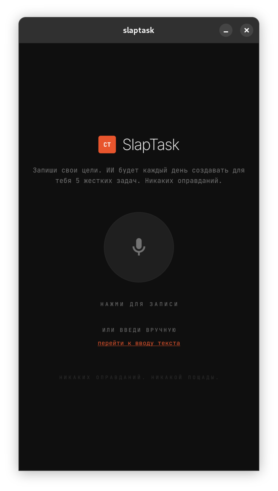
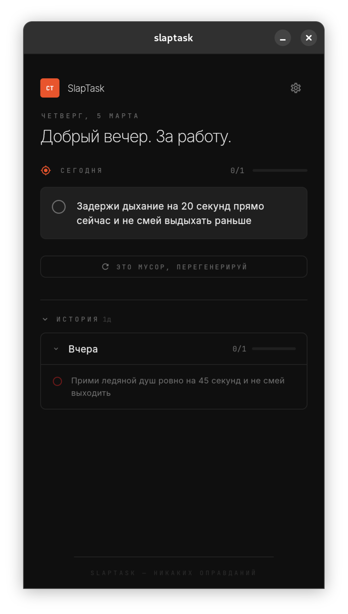
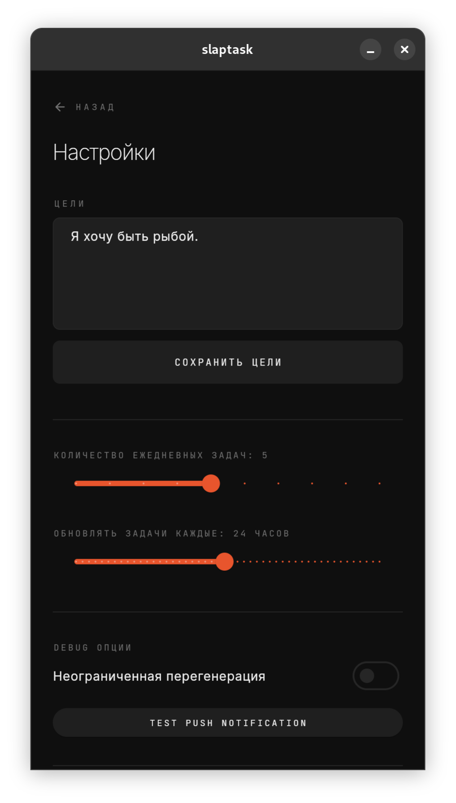

<div align="center">

# SLAPTASK

[](https://github.com/f0rgenet/slaptask/actions)
[](https://flutter.dev)
[](https://flutter.dev)
[](LICENSE)

**Агрессивный инструмент ежедневной отчетности на базе ИИ.**

Большинство таск-трекеров не работают, потому что заставляют планировать. SlapTask меняет парадигму. Вы задаете глобальные цели, система сама генерирует 5 жестких задач каждое утро.

Философия проста: **Execution over Planning.**

</div>

## <span style="color:#E8552D">Обзор</span>

SlapTask использует LLM (ProxyAPI) для анализа долгосрочных целей и истории выполнения задач. Генерация расписания происходит автоматически в фоновом режиме через определённые промежутки времени.

Если задачи провалены — сложность адаптируется, но давление сохраняется. Если выполнены — система повышает планку. Никаких оправданий.

<div align="center">
  
  
  
</div>

## <span style="color:#E8552D">Технический Стек</span>

Приложение построено на **Flutter** с использованием строгой архитектуры и разделения слоев.

| Компонент | Технология | Описание |
| :--- | :--- | :--- |
| **State Management** | `Bloc` + `Freezed` | Строго типизированное управление состоянием. |
| **Architecture** | Clean Architecture | Разделение на UI, BLOC и Data слои. |
| **Backend / AI** | ProxyAPI | Генерация задач и транскрибация голоса. |
| **Background** | `workmanager` | Гарантированное выполнение задач при убитом приложении. |
| **Local Storage** | `shared_preferences` | Local-first подход. Данные хранятся на устройстве. |
| **Audio** | `record` | Запись и кодирование аудио для голосового ввода целей. |

## <span style="color:#E8552D">Функциональность</span>

*   **ИИ генерация задач:** Превращение абстрактных целей ("хочу выучить английский") в конкретные действия ("прочитать 5 страниц книги на английском и записать новые слова").
*   **Строгая логика:** Нельзя перегенерировать задачи, если работа уже началась. Нельзя редактировать/удалять задачи.
*   **Фоновая работа:** Тихая генерация задач. Уведомление приходит только по готовности.
*   **Голосовой онбординг:** Запись целей голосом, транскрибация через API и автоматическое форматирование.
*   **Адаптивная история:** Промпт для LLM включает контекст успеха/неудач по целям.

## <span style="color:#E8552D">Архитектура</span>

```text
lib/
├── blocs/          # Бизнес-логика (BLoC) и Freezed классы событий/состояний
├── models/         # Сериализуемые модели данных
├── screens/        # Полноэкранные виджеты (страницы)
├── services/       # Работа с API, хранилищем и фоновыми задачами
├── widgets/        # Переиспользуемые UI компоненты
├── main.dart       # Точка входа и конфигурация Workmanager
└── theme.dart      # Константы дизайн-системы
```

## <span style="color:#E8552D">Установка и запуск</span>

Для запуска потребуется Flutter SDK и ключ ProxyAPI.

1.  **Клонирование репозитория:**
    ```bash
    git clone https://github.com/f0rgenet/slaptask.git
    cd slaptask
    ```

2.  **Установка зависимостей:**
    ```bash
    flutter pub get
    ```

3.  **Конфигурация окружения:**
    Создайте файл `.env` в корне проекта:
    ```env
    PROXYAPI_KEY=sk-your-api-key-here
    ```

4.  **Кодогенерация (Freezed):**
    Критически важный шаг для работы BLoC и моделей.
    ```bash
    dart run build_runner build -d
    ```

5.  **Запуск:**
    ```bash
    flutter run
    ```
